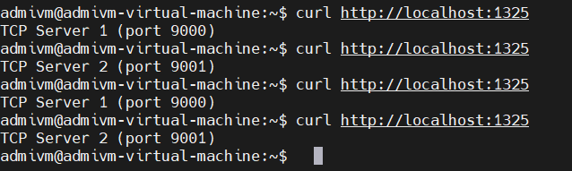
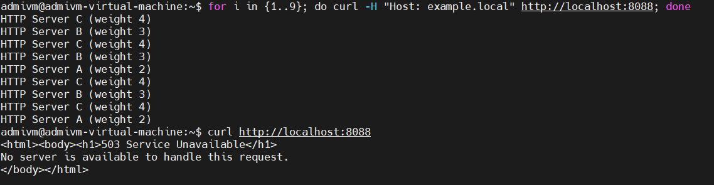
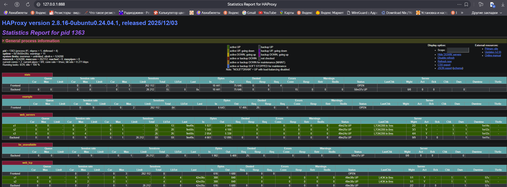

# Домашнее задание к занятию 2 «Кластеризация и балансировка нагрузки» Гришин Д.А
---


### Задание 1
- Запустите два simple python сервера на своей виртуальной машине на разных портах
- Установите и настройте HAProxy, воспользуйтесь материалами к лекции по [ссылке](2/)
- Настройте балансировку Round-robin на 4 уровне.
- На проверку направьте конфигурационный файл haproxy, скриншоты, где видно перенаправление запросов на разные серверы при обращении к HAProxy.


### Задание 2
- Запустите три simple python сервера на своей виртуальной машине на разных портах
- Настройте балансировку Weighted Round Robin на 7 уровне, чтобы первый сервер имел вес 2, второй - 3, а третий - 4
- HAproxy должен балансировать только тот http-трафик, который адресован домену example.local
- На проверку направьте конфигурационный файл haproxy, скриншоты, где видно перенаправление запросов на разные серверы при обращении к HAProxy c использованием домена example.local и без него.


---


### Задание 1
---    
haproxy.cfg
```
listen web_tcp
        bind :1325
        mode tcp
        balance roundrobin
        server s1 127.0.0.1:9000 check inter 3s
        server s2 127.0.0.1:9001 check inter 3s

```


---
### Задание 2
---
haproxy.cfg
```
listen stats
        bind :888
        mode http
        stats enable
        stats uri /stats
        stats refresh 5s
        stats realm Haproxy\ Statistics

frontend example
        mode http
        bind :8088
        acl ACL_example_local hdr(host) -i example.local
        use_backend web_servers if ACL_example_local
        default_backend be_unavailable

backend web_servers
        mode http
        balance roundrobin
        option httpchk
        http-check send meth GET uri /index.html
        server s1 127.0.0.1:8000 weight 2 check
        server s2 127.0.0.1:8001 weight 3 check
        server s3 127.0.0.1:8002 weight 4 check

backend be_unavailable
        mode http
        http-request deny deny_status 503
```


---
